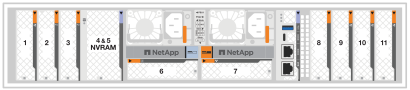
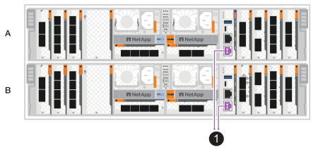
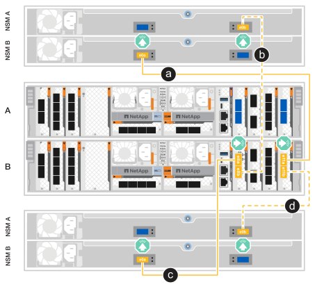

= 为 ASA A70 和 ASA A90 存储系统的硬件布线
:allow-uri-read: 
:icons: font
:imagesdir: ../media/

[role="lead"]
将 ASA A70 或 ASA A90 存储系统连接到网络和存储架，以实现集群通信、管理访问和 SAN 主机连接。此过程包括集群/HA 互连、管理网络、主机网络和存储架连接的布线。

.开始之前
有关将存储系统连接到网络交换机的信息、请与网络管理员联系。

.关于此任务
* 以下过程显示了常见配置。具体布线取决于为存储系统订购的组件。有关全面的配置和插槽优先级详细信息，请参见 link:https://hwu.netapp.com["NetApp Hardware Universe"^]。
* ASA A70 和 ASA A90 上的 I/O 插槽编号为 1 到 11。
+

* 布线图中的箭头图标显示了将连接器插入端口时电缆连接器推拉卡舌的正确方向(向上或向下)。
+
插入连接器时、您应感觉到连接器卡入到位；如果您不觉得连接器卡嗒声、请将其卸下、然后将其翻转并重试。

+
image:../media/drw_cable_pull_tab_direction_ieops-1699.svg["电缆拉片方向"]

* 如果使用缆线连接到光纤交换机、请先将光纤收发器插入控制器端口、然后再使用缆线连接到交换机端口。

[[step-1-cable-the-clusterha-connections]]
== 第1步：为集群/HA连接布线

连接控制器以创建 ONTAP 集群连接。对于无交换机集群，请将控制器彼此连接。对于有交换机集群，请将控制器连接到集群网络交换机。

NOTE: 集群互连流量和HA流量共享相同的物理端口。

[role="tabbed-block"]
====
.无交换机集群布线
--
当两个控制器直接相互连接而不使用集群网络交换机时，请使用此布线选项。

使用集群/HA互连缆线将端口e1a连接到e1a、并将端口e7a连接到e7a。

.步骤
. 将控制器A上的端口e1a连接到控制器B上的端口e1a
. 将控制器 A 上的端口 e7a 连接到控制器 B 上的端口 e7a。
+
*集群/HA互连缆线*

+
image::../media/oie_cable_25Gb_Ethernet_SFP28_IEOPS-1069.svg[集群HA缆线]

+
image::../media/drw_70-90_tnsc_cluster_cabling_ieops-1653.svg[双节点无交换机集群布线图]

--
.Switched cluster cabling
--
当控制器连接到集群网络交换机而不是直接相互连接时，请使用此布线选项。

使用 100 GbE 电缆将端口 e1a 和 e7a 连接到集群网络交换机。

NOTE: ONTAP 9.16.1 及更高版本支持切换集群配置。

.步骤
. 将控制器A上的端口e1a和控制器B上的端口e1a连接到集群网络交换机A
. 将控制器A上的端口e7a和控制器B上的端口e7a连接到集群网络交换机B
+
*100 GbE电缆*

+
image::../media/oie_cable100_gbe_qsfp28.png[100 GbE 电缆]

+
image::../media/drw_70-90_switched_cluster_cabling_ieops-1657.svg[使用缆线将集群连接到集群网络]

--
====

[[step-2-cable-the-host-network-connections]]
== 第2步：为主机网络连接布线

将以太网模块端口连接到主机网络。

下面是一些典型的主机网络布线示例。有关您的特定系统配置，请参阅 link:https://hwu.netapp.com["NetApp Hardware Universe"^]。

[role="tabbed-block"]
====
.100 GbE 主机网络
--
将端口 e9a 和 e9b 连接到 100 GbE 以太网数据网络交换机。

NOTE: 为了最大限度地提高集群和 HA 流量的系统性能，请不要使用端口 e1b 和 e7b 进行主机网络连接。使用单独的主机卡以最大限度地提高性能。

.步骤
. 将控制器 A 端口 e9a 和控制器 B 端口 e9a 连接到以太网数据网络交换机。
. 将控制器 A 端口 e9b 和控制器 B 端口 e9b 连接到以太网数据网络交换机。
+
*100 GbE电缆*

+
image::../media/oie_cable_sfp_gbe_copper.svg[100 GbE 以太网电缆]

+
image::../media/drw_70-90_network_cabling1_ieops-1654.svg[缆线连接到 100 GbE 以太网]

--
.10/25 GbE 主机网络
--
将每个控制器上的 10/25 GbE I/O 模块端口连接到主机网络交换机。

*10/25 GbE 电缆*

image::../media/oie_cable_sfp_gbe_copper.svg[10/25 GbE 电缆]

image::../media/drw_70-90_network_cabling2_ieops-1655.svg[连接到 10/25 GbE 以太网的缆线]

--
====

[[step-3-cable-the-management-network-connections]]
== 第3步：为管理网络连接布线

将控制器连接到管理网络。

使用1000BASE-T RJ-45缆线将每个控制器上的管理(扳手)端口连接到管理网络交换机。

.步骤
. 将控制器 A 上的管理（扳手）端口连接到管理网络交换机。
. 将控制器 B 上的管理（扳手）端口连接到管理网络交换机。
+
*1000BASE-T RJ-45电缆*

+
image::../media/oie_cable_rj45.svg[RJ-45电缆]

+

IMPORTANT: 请勿插入电源线。

[[step-4-cable-the-shelf-connections]]
== 第4步：为磁盘架连接布线

ASA A70 和 ASA A90 存储系统支持配备 NSM100 或 NSM100B 模块的 NS224 盘架。这些模块之间的主要区别是：

* NSM100 机架模块使用内置端口 e0a 和 e0b。
* NSM100B 架模块使用插槽 1 中的端口 e1a 和 e1b。

以下布线示例显示了在参考盘架模块端口时 NS224 盘架中的 NSM100 模块。

有关存储系统和所有布线选项(例如光纤和交换机连接)支持的最大磁盘架数量，请参见link:https://hwu.netapp.com["NetApp Hardware Universe"^]。

[role="tabbed-block"]
====
.一个 NS224 存储架
--
当您有一个 NS224 机架时，请使用此布线选项。

将每个控制器连接到NS224磁盘架上的NSM模块。图中显示了每个控制器的布线：控制器A的布线显示为蓝色、控制器B的布线显示为黄色。

*100 GbE QSFP28铜缆*

image::../media/oie_cable100_gbe_qsfp28.svg[100 GbE QSFP28铜缆]

.步骤
. 将控制器A端口e11a连接到NSM A端口e0a。
. 将控制器 A 端口 e11b 连接到 NSM B 端口 e0b。
+
image:../media/drw_a70-90_1shelf_cabling_a_ieops-1731.svg["控制器A e11a和e11b连接到一个NS224磁盘架"]

. 将控制器B端口e11a连接到NSM B端口e0a。
. 将控制器B端口e11b连接到NSM A端口e0b。
+
image:../media/drw_a70-90_1shelf_cabling_b_ieops-1732.svg["控制器B e11a和e11b连接到一个NS224磁盘架"]

--
.两个 NS224 存储盘架
--
当您有两个 NS224 机架时，请使用此布线选项。

将每个控制器连接到两个NS224磁盘架上的NSM模块。图中显示了每个控制器的布线：控制器A的布线显示为蓝色、控制器B的布线显示为黄色。

*100 GbE QSFP28铜缆*

image::../media/oie_cable100_gbe_qsfp28.svg[100 GbE QSFP28铜缆]

.步骤
. 在控制器A上、连接以下端口：
+
.. 将端口e11a连接到磁盘架1 NSM A端口e0a。
.. 将端口 e8b 连接到机架 1 NSM B 端口 e0b。
.. 将端口 e8a 连接到托架 2 NSM A 端口 e0a。
.. 将端口e11b连接到磁盘架2 NSM B端口e0b。
+
image:../media/drw_a70-90_2shelf_cabling_a_ieops-1733.svg["控制器A的控制器到磁盘架连接"]

. 在控制器B上、连接以下端口：
+
.. 将端口e11a连接到磁盘架1 NSM B端口e0a。
.. 将端口 e8b 连接到托架 1 NSM A 端口 e0b。
.. 将端口 e8a 连接到机架 2 NSM B 端口 e0a。
.. 将端口e11b连接到磁盘架2 NSM A端口e0b。
+

--
====
.下一步是什么？
将存储控制器连接到网络并将控制器连接到存储架之后，您可以link:power-on-hardware.html["启动ASA R2存储系统"]。
