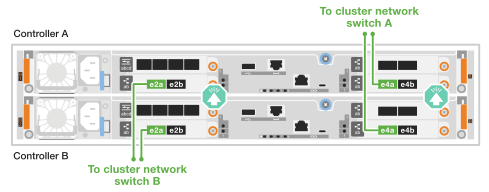
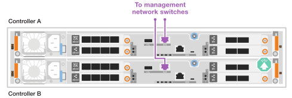

= 为 ASA C30 存储系统的硬件布线
:allow-uri-read: 
:icons: font
:imagesdir: ../media/

[role="lead"]
将 ASA C30 存储系统连接到网络和存储机架，以实现集群通信、管理访问和 SAN 主机连接。此过程包括集群/HA 互连、管理网络、主机网络和存储机架连接的布线。

.开始之前
有关将存储系统连接到网络交换机的信息、请与网络管理员联系。

.关于此任务
* 以下过程显示了常见配置。具体布线取决于为存储系统订购的组件。有关全面的配置和插槽优先级详细信息，请参见 link:https://hwu.netapp.com["NetApp Hardware Universe"^]。
* 布线图中的箭头图标显示了将连接器插入端口时电缆连接器推拉卡舌的正确方向(向上或向下)。
+
插入连接器时、您应感觉到连接器卡入到位；如果您不觉得连接器卡嗒声、请将其卸下、然后将其翻转并重试。

+
image:../media/drw_cable_pull_tab_direction_ieops-1699.svg["电缆拉片方向"]

* 如果使用缆线连接到光纤交换机、请先将光纤收发器插入控制器端口、然后再使用缆线连接到交换机端口。

[[step-1-cable-the-clusterha-connections]]
== 第1步：为集群/HA连接布线

连接控制器以创建 ONTAP 集群连接。对于无交换机集群，请将控制器彼此连接。对于有交换机集群，请将控制器连接到集群网络交换机。

NOTE: 集群互连流量和HA流量共享相同的物理端口。

[role="tabbed-block"]
====
.无交换机集群布线
--
当两个控制器直接相互连接而不使用集群网络交换机时，请使用此布线选项。

.配备两个 2 端口 40/100 GbE I/O 模块的 ASA C30
对插槽 2 和 4 中的 I/O 模块上的集群/HA 互连端口进行电缆连接。

NOTE: 集群互连流量和HA流量共享相同的物理端口(位于插槽2和4的I/O模块上)。端口为40/100 GbE。

.步骤
. 将控制器A端口E2A连接到控制器B端口E2A。
. 将控制器A端口e4a连接到控制器B端口e4a。
+

NOTE: I/O模块端口e2b和e4b未使用、可用于主机网络连接。

+
*100 GbE集群/HA互连缆线*

+
image::../media/oie_cable100_gbe_qsfp28.png[集群HA 100 GbE缆线]

+
image::../media/drw_isi_a30-50_switchless_2p_100gbe_2card_cabling_ieops-2011.svg[使用两个 100 GbE I/O 模块的无交换机集群布线图]

.具有 1 个 2 端口 40/100 GbE I/O 模块的 ASA C30
对插槽 4 中 I/O 模块上的群集/HA 互连端口进行电缆连接。

NOTE: 集群互连流量和HA流量共享相同的物理端口(位于插槽4中的I/O模块上)。端口为40/100 GbE。

.步骤
. 将控制器A端口e4a连接到控制器B端口e4a。
. 将控制器A端口e4b连接到控制器B端口e4b。
+
*100 GbE集群/HA互连缆线*

+
image::../media/oie_cable100_gbe_qsfp28.png[集群HA 100 GbE缆线]

+
image::../media/drw_isi_a30-50_switchless_2p_100gbe_1card_cabling_ieops-1925.svg[使用一个 100 GbE I/O 模块的无交换机集群布线图]

--
.Switched cluster cabling
--
当控制器连接到集群网络交换机而不是直接相互连接时，请使用此布线选项。

.配备两个 2 端口 40/100 GbE I/O 模块的 ASA C30
将插槽 2 和 4 中的 I/O 模块上的集群/HA 互连端口连接到集群网络交换机。

NOTE: 集群互连流量和HA流量共享相同的物理端口(位于插槽2和4的I/O模块上)。端口为40/100 GbE。

.步骤
. 将控制器 A 端口 e4a 连接到集群网络交换机 A。
. 将控制器 A 端口 e2a 连接到集群网络交换机 B。
. 将控制器 B 端口 e4a 连接到集群网络交换机 A。
. 将控制器 B 端口 e2a 连接到集群网络交换机 B。
+

NOTE: I/O模块端口e2b和e4b未使用、可用于主机网络连接。

+
*40/100 GbE集群/HA互连缆线*

+
image::../media/oie_cable100_gbe_qsfp28.png[集群HA 40/100 GbE缆线]

+

.具有 1 个 2 端口 40/100 GbE I/O 模块的 ASA C30
将插槽 4 中 I/O 模块上的集群/HA 互连端口连接到集群网络交换机。

NOTE: 集群互连流量和HA流量共享相同的物理端口(位于插槽4中的I/O模块上)。端口为40/100 GbE。

.步骤
. 将控制器 A 端口 e4a 连接到集群网络交换机 A。
. 将控制器 A 端口 e4b 连接到集群网络交换机 B。
. 将控制器 B 端口 e4a 连接到集群网络交换机 A。
. 将控制器 B 端口 e4b 连接到集群网络交换机 B。
+
*40/100 GbE集群/HA互连缆线*

+
image::../media/oie_cable100_gbe_qsfp28.png[集群HA 40/100 GbE缆线]

+
image::../media/drw_isi_a30-50_2p_100gbe_1card_switched_cabling_ieops-1926.svg[使用缆线将集群连接到集群网络]

--
====

[[step-2-cable-the-host-network-connections]]
== 第2步：为主机网络连接布线

将以太网模块端口或光纤通道(FC)模块端口连接到主机网络。

[role="tabbed-block"]
====
.以太网主机布线
--
根据您的 I/O 模块配置，使用适当的端口将控制器连接到以太网主机网络。

.配备两个 2 端口 40/100 GbE I/O 模块的 ASA C30
在每个控制器上、使用缆线将端口e2b和e4b连接到以太网主机网络交换机。

NOTE: 插槽2和4中I/O模块上的端口为40/100 GbE (主机连接为40/100 GbE)。

*40/100 GbE缆线*

image::../media/oie_cable_sfp_gbe_copper.png[40/100 GbE 电缆]

image::../media/drw_isi_a30-50_host_2p_40-100gbe_2card_cabling_ieops-2014.svg[连接到 40/100 GbE 以太网主机网络交换机的缆线]

.具有 1 个 4 端口 10/25 GbE I/O 模块的 ASA C30
在每个控制器上，将端口 e2a、e2b、e2c 和 e2d 用线缆连接到以太网主机网络交换机。

*1025 GbE缆线*

image:../media/oie_cable_sfp_gbe_copper.png["GbE SFP 铜质连接器，宽度=100px"]

image::../media/drw_isi_a30-50_host_2p_40-100gbe_1card_cabling_ieops-1923.svg[连接到 10/25 GbE 以太网主机网络交换机的缆线]

--
.FC 主机布线
--
使用系统中的 FC I/O 模块将控制器连接到光纤通道主机网络。

.配备一个 4 端口 64 Gb/s FC I/O 模块的 ASA C30
在每个控制器上，将端口 2a、2b、2c 和 2d 用线缆连接到 FC 主机网络交换机。

*64 Gb/秒FC缆线*

image:../media/oie_cable_sfp_gbe_copper.png["64 Gb/s FC 电缆，width=100px"]

image::../media/drw_isi_a30-50_4p_64gb_fc_1card_cabling_ieops-1924.svg[连接到 64 Gb/s FC 主机网络交换机的电缆]

--
====

[[step-3-cable-the-management-network-connections]]
== 第3步：为管理网络连接布线

将控制器连接到管理网络。

将每个控制器上的管理(扳手)端口连接到管理网络交换机。

*1000BASE-T RJ-45电缆*

image::../media/oie_cable_rj45.png[RJ-45电缆]

IMPORTANT: 请勿插入电源线。

[[step-4-cable-the-shelf-connections]]
== 第4步：为磁盘架连接布线

NS224 机架布线流程中显示的是 NSM100B 模块，而不是 NSM100 模块。无论使用哪种类型的 NSM 模块，布线流程均相同，只是端口名称不同：

* NSM100B 模块使用插槽 1 中 I/O 模块上的端口 e1a 和 e1b。
* NSM100 模块使用内置（板载）端口 e0a 和 e0b。

有关存储系统和所有布线选项(例如光纤和交换机连接)支持的最大磁盘架数量，请参见link:https://hwu.netapp.com["NetApp Hardware Universe"^]。

使用存储系统附带的存储电缆将每个控制器连接到 NS224 盘架上的每个 NSM 模块。

*100 GbE QSFP28铜缆*

image::../media/oie_cable100_gbe_qsfp28.png[100 GbE QSFP28铜缆]

图中显示控制器A的布线为蓝色、控制器B的布线为黄色。

.步骤
. 将控制器A端口e3a连接到NSM A端口e1a。
. 将控制器A端口e3b连接到NSM B端口e1b。
+
image:../media/drw_isi_g_1_ns224_controller_a_cabling_ieops-1945.svg["控制器A端口e3a和e3b连接到一个NS224磁盘架"]

. 将控制器B端口e3a连接到NSM B端口e1a。
. 将控制器B端口e3b连接到NSM A端口e1b。
+
image:../media/drw_isi_g_1_ns224_controller_b_cabling_ieops-1946.svg["控制器B端口e3a和e3b连接到一个NS224磁盘架"]

.下一步是什么？
将存储控制器连接到网络并将控制器连接到存储架之后，您可以link:power-on-hardware.html["启动ASA R2存储系统"]。
