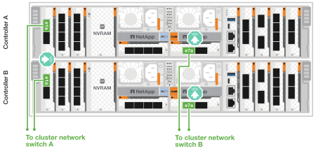
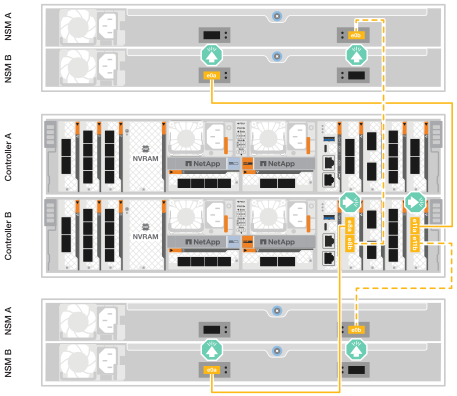

= 为ASA R2存储系统的硬件布线
:allow-uri-read: 
:icons: font
:imagesdir: ../media/

[role="lead"]
安装ASA R2存储系统的机架硬件后、请安装控制器的网络缆线、并在控制器和存储架之间连接缆线。

.开始之前
有关将存储系统连接到网络交换机的信息、请与网络管理员联系。

.关于此任务
* 以下过程显示了常见配置。具体布线取决于为存储系统订购的组件。有关全面的配置和插槽优先级详细信息，请参见 link:https://hwu.netapp.com["NetApp Hardware Universe"^]。
* 集群/HA和主机网络布线过程显示了常见配置。
+
如果在布线过程中没有看到您的配置，请转至link:https://hwu.netapp.com["NetApp Hardware Universe"^]获得全面的配置和插槽优先级信息，以便正确连接存储系统。

* 如果您有 ASA A1K、ASA A70 或 ASA A90 存储系统，则 I/O 插槽编号为 1 到 11。
+
image::../media/drw_a1K_back_slots_labeled_ieops-2162.svg[ASA A1K ASA A70 和 ASA A90 控制器上的插槽编号]

* 布线图中的箭头图标显示了将连接器插入端口时电缆连接器推拉卡舌的正确方向(向上或向下)。
+
插入连接器时、您应感觉到连接器卡入到位；如果您不觉得连接器卡嗒声、请将其卸下、然后将其翻转并重试。

+
image:../media/drw_cable_pull_tab_direction_ieops-1699.svg["电缆拉片方向"]

* 如果使用缆线连接到光纤交换机、请先将光纤收发器插入控制器端口、然后再使用缆线连接到交换机端口。

== 第1步：为集群/HA连接布线

使用缆线将控制器连接到ONTAP集群。此过程因存储系统型号和I/O模块配置而异。

NOTE: 集群互连流量和HA流量共享相同的物理端口。

[role="tabbed-block"]
====
.A1K
--
创建ONTAP集群连接。对于无交换机集群、请将控制器相互连接。对于有交换机集群、将控制器连接到集群网络交换机。

.无交换机集群布线
[%collapsible]
=====
使用集群/HA互连缆线将端口e1a连接到e1a、并将端口e7a连接到e7a。

.步骤
. 将控制器A上的端口e1a连接到控制器B上的端口e1a
. 将控制器A上的端口e7a连接到控制器B上的端口e1a
+
*集群/HA互连缆线*

+
image::../media/oie_cable_25Gb_Ethernet_SFP28_IEOPS-1069.svg[集群HA缆线]

+
image::../media/drw_a1k_tnsc_cluster_cabling_ieops-1648.svg[双节点无交换机集群布线图]

=====
.Switched cluster cabling
[%collapsible]
=====
使用100 GbE缆线将端口e1a连接到e1a、并将端口e7a连接到e7a。

NOTE: 有交换机集群配置受支持的9.16.1及更高版本。

.步骤
. 将控制器A上的端口e1a和控制器B上的端口e1a连接到集群网络交换机A
. 将控制器A上的端口e7a和控制器B上的端口e7a连接到集群网络交换机B
+
*100 GbE电缆*

+
image::../media/oie_cable100_gbe_qsfp28.png[100 Gb缆线]

+
image::../media/drw_a1k_switched_cluster_cabling_ieops-1652.svg[使用缆线将集群连接到集群网络]

=====
--
.A70和A90
--
创建ONTAP集群连接。对于无交换机集群、请将控制器相互连接。对于有交换机集群、将控制器连接到集群网络交换机。

.无交换机集群布线
[%collapsible]
=====
使用集群/HA互连缆线将端口e1a连接到e1a、并将端口e7a连接到e7a。

.步骤
. 将控制器A上的端口e1a连接到控制器B上的端口e1a
. 将控制器A上的端口e7a连接到控制器B上的端口e1a
+
*集群/HA互连缆线*

+
image::../media/oie_cable_25Gb_Ethernet_SFP28_IEOPS-1069.svg[集群HA缆线]

+
image::../media/drw_70-90_tnsc_cluster_cabling_ieops-1653.svg[双节点无交换机集群布线图]

=====
.Switched cluster cabling
[%collapsible]
=====
使用100 GbE缆线将端口e1a连接到e1a、并将端口e7a连接到e7a。

NOTE: 有交换机集群配置受支持的9.16.1及更高版本。

.步骤
. 将控制器A上的端口e1a和控制器B上的端口e1a连接到集群网络交换机A
. 将控制器A上的端口e7a和控制器B上的端口e7a连接到集群网络交换机B
+
*100 GbE电缆*

+
image::../media/oie_cable100_gbe_qsfp28.png[100 Gb缆线]

+

=====
--
.-20、A30和A50
--
创建ONTAP集群连接。对于无交换机集群、请将控制器相互连接。对于有交换机集群、将控制器连接到集群网络交换机。

*无交换机集群布线*

将控制器相互连接以创建ONTAP集群连接。

.带有两个双端口40/100 GbE I/O模块的ASA A30和ASA A50
[%collapsible]
=====
.步骤
. 连接集群/HA互连连接：
+

NOTE: 集群互连流量和HA流量共享相同的物理端口(位于插槽2和4的I/O模块上)。端口为40/100 GbE。

+
.. 将控制器A端口E2A连接到控制器B端口E2A。
.. 将控制器A端口e4a连接到控制器B端口e4a。
+

NOTE: I/O模块端口e2b和e4b未使用、可用于主机网络连接。

+
*100 GbE集群/HA互连缆线*

+
image::../media/oie_cable100_gbe_qsfp28.png[集群HA 100 GbE缆线]

+
image::../media/drw_isi_a30-50_switchless_2p_100gbe_2card_cabling_ieops-2011.svg[使用两个100GbE IO模块的A30和A50无交换机集群布线图]

=====
.带有一个双端口40/100 GbE I/O模块的ASA A30和ASA A50
[%collapsible]
=====
.步骤
. 连接集群/HA互连连接：
+

NOTE: 集群互连流量和HA流量共享相同的物理端口(位于插槽4中的I/O模块上)。端口为40/100 GbE。

+
.. 将控制器A端口e4a连接到控制器B端口e4a。
.. 将控制器A端口e4b连接到控制器B端口e4b。
+
*100 GbE集群/HA互连缆线*

+
image::../media/oie_cable100_gbe_qsfp28.png[集群HA 100 GbE缆线]

+
image::../media/drw_isi_a30-50_switchless_2p_100gbe_1card_cabling_ieops-1925.svg[使用一个100GbE IO模块的A30和A50无交换机集群布线图]

=====
.带有一个双端口1025 GbE I/O模块的ASA A20
[%collapsible]
=====
.步骤
. 连接集群/HA互连连接：
+

NOTE: 集群互连流量和HA流量共享相同的物理端口(位于插槽4中的I/O模块上)。端口为1025 GbE。

+
.. 将控制器A端口e4a连接到控制器B端口e4a。
.. 将控制器A端口e4b连接到控制器B端口e4b。
+
*25 GbE集群/HA互连缆线*

+
image:../media/oie_cable_sfp_gbe_copper.png["GbE SFP铜缆连接器、宽度=100pp"]

+
image::../media/drw_isi_a20_switchless_2p_25gbe_cabling_ieops-2018.svg[使用一个25 GbE IO模块的2020无交换机集群布线图]

=====
*交换集群布线*

将控制器连接到集群网络交换机以创建ONTAP集群连接。

.具有两个双端口40/100 GbE I/O模块的ASA A30或ASA A50
[%collapsible]
=====
.步骤
. 为集群/HA互连连接布线：
+

NOTE: 集群互连流量和HA流量共享相同的物理端口(位于插槽2和4的I/O模块上)。端口为40/100 GbE。

+
.. 将控制器 A 端口 e4a 连接到集群网络交换机 A。
.. 将控制器 A 端口 e2a 连接到集群网络交换机 B。
.. 将控制器 B 端口 e4a 连接到集群网络交换机 A。
.. 将控制器 B 端口 e2a 连接到集群网络交换机 B。
+

NOTE: I/O模块端口e2b和e4b未使用、可用于主机网络连接。

+
*40/100 GbE集群/HA互连缆线*

+
image::../media/oie_cable100_gbe_qsfp28.png[集群HA 40/100 GbE缆线]

+
image::../media/drw_isi_a30-50_switched_2p_100gbe_2card_cabling_ieops-2013.svg[使用两个100GbE IO模块的A30和A50交换集群布线图]

=====
.带有一个双端口40/100 GbE I/O模块的ASA A30或ASA A50
[%collapsible]
=====
.步骤
. 使用缆线将控制器连接到集群网络交换机：
+

NOTE: 集群互连流量和HA流量共享相同的物理端口(位于插槽4中的I/O模块上)。端口为40/100 GbE。

+
.. 将控制器 A 端口 e4a 连接到集群网络交换机 A。
.. 将控制器 A 端口 e4b 连接到集群网络交换机 B。
.. 将控制器 B 端口 e4a 连接到集群网络交换机 A。
.. 将控制器 B 端口 e4b 连接到集群网络交换机 B。
+
*40/100 GbE集群/HA互连缆线*

+
image::../media/oie_cable100_gbe_qsfp28.png[集群HA 40/100 GbE缆线]

+
image::../media/drw_isi_a30-50_2p_100gbe_1card_switched_cabling_ieops-1926.svg[使用缆线将集群连接到集群网络]

=====
.带有一个双端口1025 GbE I/O模块的ASA A20
[%collapsible]
=====
. 使用缆线将控制器连接到集群网络交换机：
+

NOTE: 集群互连流量和HA流量共享相同的物理端口(位于插槽4中的I/O模块上)。端口为1025 GbE。

+
.. 将控制器 A 端口 e4a 连接到集群网络交换机 A。
.. 将控制器 A 端口 e4b 连接到集群网络交换机 B。
.. 将控制器 B 端口 e4a 连接到集群网络交换机 A。
.. 将控制器 B 端口 e4b 连接到集群网络交换机 B。
+
*1025 GbE集群/HA互连缆线*

+
image::../media/oie_cable_sfp_gbe_copper.png[GbE SFP铜缆连接器]

+
image::../media/drw_isi_a20_switched_2p_25gbe_cabling_ieops-2019.svg[使用一个25GbE IO模块的2020交换集群布线图]

=====
--
.C30
--
创建ONTAP集群连接。对于无交换机集群、请将控制器相互连接。对于有交换机集群、将控制器连接到集群网络交换机。

*无交换机集群布线*

将控制器相互连接以创建ONTAP集群连接。

.配备两个 2 端口 40/100 GbE I/O 模块的 ASA C30
[%collapsible]
=====
.步骤
. 为集群/HA互连连接布线：
+

NOTE: 集群互连流量和HA流量共享相同的物理端口(位于插槽2和4的I/O模块上)。端口为40/100 GbE。

+
.. 将控制器A端口E2A连接到控制器B端口E2A。
.. 将控制器A端口e4a连接到控制器B端口e4a。
+

NOTE: I/O模块端口e2b和e4b未使用、可用于主机网络连接。

+
*100 GbE集群/HA互连缆线*

+
image::../media/oie_cable100_gbe_qsfp28.png[集群HA 100 GbE缆线]

+
image::../media/drw_isi_a30-50_switchless_2p_100gbe_2card_cabling_ieops-2011.svg[使用两个100GbE IO模块的A30和A50无交换机集群布线图]

=====
.具有 1 个 2 端口 40/100 GbE I/O 模块的 ASA C30
[%collapsible]
=====
.步骤
. 为集群/HA互连连接布线：
+

NOTE: 集群互连流量和HA流量共享相同的物理端口(位于插槽4中的I/O模块上)。端口为40/100 GbE。

+
.. 将控制器A端口e4a连接到控制器B端口e4a。
.. 将控制器A端口e4b连接到控制器B端口e4b。
+
*100 GbE集群/HA互连缆线*

+
image::../media/oie_cable100_gbe_qsfp28.png[集群HA 100 GbE缆线]

+
image::../media/drw_isi_a30-50_switchless_2p_100gbe_1card_cabling_ieops-1925.svg[使用一个 100GBE I/O 模块的 C30 无交换机集群布线图]

=====
*交换集群布线*

将控制器连接到集群网络交换机以创建ONTAP集群连接。

.配备两个 2 端口 40/100 GbE I/O 模块的 ASA C30
[%collapsible]
=====
.步骤
. 为集群/HA互连连接布线：
+

NOTE: 集群互连流量和HA流量共享相同的物理端口(位于插槽2和4的I/O模块上)。端口为40/100 GbE。

+
.. 将控制器 A 端口 e4a 连接到集群网络交换机 A。
.. 将控制器 A 端口 e2a 连接到集群网络交换机 B。
.. 将控制器 B 端口 e4a 连接到集群网络交换机 A。
.. 将控制器 B 端口 e2a 连接到集群网络交换机 B。
+

NOTE: I/O模块端口e2b和e4b未使用、可用于主机网络连接。

+
*40/100 GbE集群/HA互连缆线*

+
image::../media/oie_cable100_gbe_qsfp28.png[集群HA 40/100 GbE缆线]

+
image::../media/drw_isi_a30-50_switched_2p_100gbe_2card_cabling_ieops-2013.svg[使用两个 100gbe io 模块的 c30 交换集群布线图]

=====
.具有 1 个 2 端口 40/100 GbE I/O 模块的 ASA C30
[%collapsible]
=====
.步骤
. 将控制器连接到集群网络交换机：
+

NOTE: 集群互连流量和HA流量共享相同的物理端口(位于插槽4中的I/O模块上)。端口为40/100 GbE。

+
.. 将控制器 A 端口 e4a 连接到集群网络交换机 A。
.. 将控制器 A 端口 e4b 连接到集群网络交换机 B。
.. 将控制器 B 端口 e4a 连接到集群网络交换机 A。
.. 将控制器 B 端口 e4b 连接到集群网络交换机 B。
+
*40/100 GbE集群/HA互连缆线*

+
image::../media/oie_cable100_gbe_qsfp28.png[集群HA 40/100 GbE缆线]

+
image::../media/drw_isi_a30-50_2p_100gbe_1card_switched_cabling_ieops-1926.svg[使用缆线将集群连接到集群网络]

=====
--
====

== 第2步：为主机网络连接布线

将控制器连接到主机网络。

此过程因存储系统型号和I/O模块配置而异。

[role="tabbed-block"]
====
.A1K
--
将以太网模块端口连接到主机网络。

以下是一些典型的主机网络布线示例。有关您的特定系统配置、请参见 link:https://hwu.netapp.com["NetApp Hardware Universe"^] 。

.步骤
. 将端口e9a和e9b连接到以太网数据网络交换机。
+

NOTE: 为了最大程度地提高集群和HA流量的系统性能、请勿将端口e1b和e7b端口用于主机网络连接。使用单独的主机卡以最大程度地提高性能。

+
*100 GbE电缆*

+
image::../media/oie_cable_sfp_gbe_copper.svg[100 Gb以太网电缆]

+
image::../media/drw_a1k_network_cabling1_ieops-1649.svg[使用缆线连接到100 Gb以太网网络]

. 连接1025 GbE主机网络交换机。
+
*1025 GbE主机*

+
image::../media/oie_cable_sfp_gbe_copper.svg[1025Gb以太网电缆]

+
image::../media/drw_a1k_network_cabling2_ieops-1650.svg[使用缆线连接到1025Gb以太网网络]

--
.A70和A90
--
将以太网模块端口连接到主机网络。

以下是一些典型的主机网络布线示例。有关您的特定系统配置、请参见 link:https://hwu.netapp.com["NetApp Hardware Universe"^] 。

.步骤
. 将端口e9a和e9b连接到以太网数据网络交换机。
+

NOTE: 为了最大程度地提高集群和HA流量的系统性能、请勿将端口e1b和e7b端口用于主机网络连接。使用单独的主机卡以最大程度地提高性能。

+
*100 GbE电缆*

+
image::../media/oie_cable_sfp_gbe_copper.svg[100 Gb以太网电缆]

+
image::../media/drw_70-90_network_cabling1_ieops-1654.svg[使用缆线连接到100 Gb以太网网络]

. 连接1025 GbE主机网络交换机。
+
*4端口，1025 GbE主机*

+
image::../media/oie_cable_sfp_gbe_copper.svg[1025 GB电缆]

+
image::../media/drw_70-90_network_cabling2_ieops-1655.svg[使用缆线连接到100 Gb以太网网络]

--
.-20、A30和A50
--
将以太网模块端口或光纤通道(FC)模块端口连接到主机网络。

*以太网主机布线*

.带有两个双端口40/100 GbE I/O模块的ASA A30和ASA A50
[%collapsible]
=====
在每个控制器上、将端口e2b和e4b连接到以太网主机网络交换机。

NOTE: 插槽2和4中I/O模块上的端口为40/100 GbE (主机连接为40/100 GbE)。

*40/100 GbE缆线*

image::../media/oie_cable_sfp_gbe_copper.png[40/100 GB电缆]

image::../media/drw_isi_a30-50_host_2p_40-100gbe_2card_cabling_ieops-2014.svg[使用缆线连接到40/100GbE以太网主机网络交换机]

=====
.带有一个 4 端口 10/25 GbE I/O 模块的 ASA A20、A30 和 A50
[%collapsible]
=====
在每个控制器上、将端口e2a、e2b、e2c和e2d连接到以太网主机网络交换机。

*1025 GbE缆线*

image:../media/oie_cable_sfp_gbe_copper.png["GbE SFP铜缆连接器、宽度=100pp"]

image::../media/drw_isi_a30-50_host_2p_40-100gbe_1card_cabling_ieops-1923.svg[使用缆线连接到40/100GbE以太网主机网络交换机]

=====
*FC主机布线*

.配备一个 4 端口 64 Gb/s FC I/O 模块的 ASA A20、A30 和 A50
[%collapsible]
=====
在每个控制器上、将端口1a、1b、1c和1d连接到FC主机网络交换机。

*64 Gb/秒FC缆线*

image:../media/oie_cable_sfp_gbe_copper.png["64 Gb FC电缆、宽度=100个点"]

image::../media/drw_isi_a30-50_4p_64gb_fc_1card_cabling_ieops-1924.svg[连接到64 GB FC主机网络交换机的缆线]

=====
--
.C30
--
将以太网模块端口或光纤通道(FC)模块端口连接到主机网络。

*以太网主机布线*

.配备两个 2 端口 40/100 GbE I/O 模块的 ASA C30
[%collapsible]
=====
.步骤
. 在每个控制器上、使用缆线将端口e2b和e4b连接到以太网主机网络交换机。
+

NOTE: 插槽2和4中I/O模块上的端口为40/100 GbE (主机连接为40/100 GbE)。

+
*40/100 GbE缆线*

+
image::../media/oie_cable_sfp_gbe_copper.png[40/100 GB电缆]

+
image::../media/drw_isi_a30-50_host_2p_40-100gbe_2card_cabling_ieops-2014.svg[使用缆线连接到40/100GbE以太网主机网络交换机]

=====
.具有 1 个 4 端口 10/25 GbE I/O 模块的 ASA C30
[%collapsible]
=====
.步骤
. 在每个控制器上、使用缆线将端口e2a、e2b、e2C和e2d连接到以太网主机网络交换机。
+
*1025 GbE缆线*

+
image:../media/oie_cable_sfp_gbe_copper.png["GbE SFP铜缆连接器、宽度=100pp"]

+
image::../media/drw_isi_a30-50_host_2p_40-100gbe_1card_cabling_ieops-1923.svg[使用缆线连接到40/100GbE以太网主机网络交换机]

=====
.配备一个 4 端口 64 Gb/s FC I/O 模块的 ASA C30
[%collapsible]
=====
.步骤
. 在每个控制器上、使用缆线将端口1a、1b、1c和1d连接到FC主机网络交换机。
+
*64 Gb/秒FC缆线*

+
image:../media/oie_cable_sfp_gbe_copper.png["64 Gb FC电缆、宽度=100个点"]

+
image::../media/drw_isi_a30-50_4p_64gb_fc_1card_cabling_ieops-1924.svg[连接到64 GB FC主机网络交换机的缆线]

=====
--
====

== 第3步：为管理网络连接布线

将控制器连接到管理网络。

有关将存储系统连接到管理网络交换机的信息、请与网络管理员联系。

[role="tabbed-block"]
====
.A1K
--
使用1000BASE-T RJ-45缆线将每个控制器上的管理(扳手)端口连接到管理网络交换机。

image::../media/oie_cable_rj45.svg[RJ-45电缆]

*1000BASE-T RJ-45电缆*

image::../media/drw_a1k_management_connection_ieops-1651.svg[连接到管理网络]

IMPORTANT: 请勿插入电源线。

--
.A70和A90
--
使用1000BASE-T RJ-45缆线将每个控制器上的管理(扳手)端口连接到管理网络交换机。

image::../media/oie_cable_rj45.svg[RJ45电缆]

*1000BASE-T RJ-45电缆*

image::../media/drw_70-90_management_connection_ieops-1656.svg[连接到管理网络]

IMPORTANT: 请勿插入电源线。

--
.-20、A30和A50
--
将每个控制器上的管理(扳手)端口连接到管理网络交换机。

*1000BASE-T RJ-45电缆*

image::../media/oie_cable_rj45.png[RJ-45电缆]

image::../media/drw_isi_g_wrench_cabling_ieops-1928.svg[连接到管理网络]

IMPORTANT: 请勿插入电源线。

--
.C30
--
将每个控制器上的管理(扳手)端口连接到管理网络交换机。

*1000BASE-T RJ-45电缆*

image::../media/oie_cable_rj45.png[RJ-45电缆]

image::../media/drw_isi_g_wrench_cabling_ieops-1928.svg[连接到管理网络]

IMPORTANT: 请勿插入电源线。

--
====

== 第4步：为磁盘架连接布线

以下布线过程显示了如何将控制器连接到存储架。

有关存储系统和所有布线选项(例如光纤和交换机连接)支持的最大磁盘架数量，请参见link:https://hwu.netapp.com["NetApp Hardware Universe"^]。

[role="tabbed-block"]
====
.A1K
--
AFF A1K 存储系统支持带有 NSM100 或 NSM100B 模块的 NS224 磁盘架。这两个模块之间的主要区别在于：

* NSM100 机架模块使用内置端口 e0a 和 e0b。
* NSM100B 架模块使用插槽 1 中的端口 e1a 和 e1b。

以下布线示例显示了 NS224 机架中的 NSM100 模块（涉及机架模块端口）。

选择以下与您的设置匹配的布线选项之一。

.选项1：一个NS224存储架
[%collapsible]
=====
将每个控制器连接到NS224磁盘架上的NSM模块。图中显示了每个控制器的布线：控制器A的布线显示为蓝色、控制器B的布线显示为黄色。

.步骤
. 在控制器A上、连接以下端口：
+
.. 将端口e11a连接到NSM A端口e0a。
.. 将端口e11b连接到端口NSM B端口e0b。
+
image:../media/drw_a1k_1shelf_cabling_a_ieops-1703.svg["控制器A e11a和e11b连接到一个NS224磁盘架"]

. 在控制器B上、连接以下端口：
+
.. 将端口e11a连接到NSM B端口e0a。
.. 将端口e11b连接到NSM A端口e0b。
+
image:../media/drw_a1k_1shelf_cabling_b_ieops-1704.svg["将控制器 B 端口 e11a 和 e11b 连接到单个 NS224 架"]

=====
.方案2：两个NS224存储架
[%collapsible]
=====
将每个控制器连接到两个NS224磁盘架上的NSM模块。图中显示了每个控制器的布线：控制器A的布线显示为蓝色、控制器B的布线显示为黄色。

.步骤
. 在控制器A上、连接以下端口：
+
.. 将端口e11a连接到磁盘架1 NSM A端口e0a。
.. 将端口e11b连接到磁盘架2 NSM B端口e0b。
.. 将端口E10A连接到磁盘架2 NSM A端口e0a。
.. 将端口e10b连接到磁盘架1 NSM A端口e0b。
+
image:../media/drw_a1k_2shelf_cabling_a_ieops-1705.svg["控制器A的控制器到磁盘架连接"]

. 在控制器B上、连接以下端口：
+
.. 将端口e11a连接到磁盘架1 NSM B端口e0a。
.. 将端口e11b连接到磁盘架2 NSM A端口e0b。
.. 将端口E10A连接到磁盘架2 NSM B端口e0a。
.. 将端口e10b连接到磁盘架1 NSM A端口e0b。
+
image:../media/drw_a1k_2shelf_cabling_b_ieops-1706.svg["控制器B的控制器到磁盘架连接"]

=====
--
.A70和A90
--
AFF A70 和 90 存储系统支持带有 NSM100 或 NSM100B 模块的 NS224 磁盘架。这两个模块之间的主要区别在于：

* NSM100 机架模块使用内置端口 e0a 和 e0b。
* NSM100B 架模块使用插槽 1 中的端口 e1a 和 e1b。

以下布线示例显示了 NS224 机架中的 NSM100 模块（涉及机架模块端口）。

选择以下与您的设置匹配的布线选项之一。

.选项1：一个NS224存储架
[%collapsible]
=====
将每个控制器连接到NS224磁盘架上的NSM模块。图中显示了每个控制器的布线：控制器A的布线显示为蓝色、控制器B的布线显示为黄色。

*100 GbE QSFP28铜缆*

.步骤
. 将控制器A端口e11a连接到NSM A端口e0a。
. 将控制器A端口e11b连接到端口NSM B端口e0b。
+
image:../media/drw_a70-90_1shelf_cabling_a_ieops-1731.svg["控制器A e11a和e11b连接到一个NS224磁盘架"]

. 将控制器B端口e11a连接到NSM B端口e0a。
. 将控制器B端口e11b连接到NSM A端口e0b。
+
image:../media/drw_a70-90_1shelf_cabling_b_ieops-1732.svg["控制器B e11a和e11b连接到一个NS224磁盘架"]

=====
.方案2：两个NS224存储架
[%collapsible]
=====
将每个控制器连接到两个NS224磁盘架上的NSM模块。图中显示了每个控制器的布线：控制器A的布线显示为蓝色、控制器B的布线显示为黄色。

*100 GbE QSFP28铜缆*

.步骤
. 在控制器A上、连接以下端口：
+
.. 将端口e11a连接到磁盘架1的NSM A端口e0a。
.. 将端口e11b连接到磁盘架2的NSM B端口e0b。
.. 将端口E8a连接到磁盘架2的NSM A端口e0a。
.. 将端口e8b连接到磁盘架1的NSM B端口e0b。
+
image:../media/drw_a70-90_2shelf_cabling_a_ieops-1733.svg["控制器A的控制器到磁盘架连接"]

. 在控制器B上、连接以下端口：
+
.. 将端口e11a连接到磁盘架1的NSM B端口e0a。
.. 将端口e11b连接到磁盘架2的NSM A端口e0b。
.. 将端口E8a连接到磁盘架2的NSM B端口e0a。
.. 将端口e8b连接到磁盘架1的NSM A端口e0b。
+

=====
--
.-20、A30和A50
--
NS224 机架布线流程中显示的是 NSM100B 模块，而不是 NSM100 模块。无论使用哪种类型的 NSM 模块，布线流程均相同，只是端口名称不同：

* NSM100B 模块使用插槽 1 中 I/O 模块上的端口 e1a 和 e1b。
* NSM100 模块使用内置（板载）端口 e0a 和 e0b。

使用存储系统附带的存储电缆将每个控制器连接到 NS224 架上的每个 NSM 模块，存储电缆可以是以下电缆类型：

*100 GbE QSFP28铜缆*

image::../media/oie_cable100_gbe_qsfp28.png[100 GbE QSFP28铜缆]

图中显示控制器A的布线为蓝色、控制器B的布线为黄色。

.步骤
. 将控制器A连接到磁盘架：
+
.. 将控制器A端口e3a连接到NSM A端口e1a。
.. 将控制器A端口e3b连接到NSM B端口e1b。
+
image:../media/drw_isi_g_1_ns224_controller_a_cabling_ieops-1945.svg["控制器A端口e3a和e3b连接到一个NS224磁盘架"]

. 将控制器B连接到磁盘架：
+
.. 将控制器B端口e3a连接到NSM B端口e1a。
.. 将控制器B端口e3b连接到NSM A端口e1b。
+
image:../media/drw_isi_g_1_ns224_controller_b_cabling_ieops-1946.svg["控制器B端口e3a和e3b连接到一个NS224磁盘架"]

--
.C30
--
NS224 机架布线流程中显示的是 NSM100B 模块，而不是 NSM100 模块。无论使用哪种类型的 NSM 模块，布线流程均相同，只是端口名称不同：

* NSM100B 模块使用插槽 1 中 I/O 模块上的端口 e1a 和 e1b。
* NSM100 模块使用内置（板载）端口 e0a 和 e0b。

使用存储系统附带的存储电缆将每个控制器连接到 NS224 架上的每个 NSM 模块，存储电缆可以是以下电缆类型：

*100 GbE QSFP28铜缆*

image::../media/oie_cable100_gbe_qsfp28.png[100 GbE QSFP28铜缆]

图中显示控制器A的布线为蓝色、控制器B的布线为黄色。

.步骤
. 将控制器A连接到磁盘架：
+
.. 将控制器A端口e3a连接到NSM A端口e1a。
.. 将控制器A端口e3b连接到NSM B端口e1b。
+
image:../media/drw_isi_g_1_ns224_controller_a_cabling_ieops-1945.svg["控制器A端口e3a和e3b连接到一个NS224磁盘架"]

. 将控制器B连接到磁盘架：
+
.. 将控制器B端口e3a连接到NSM B端口e1a。
.. 将控制器B端口e3b连接到NSM A端口e1b。
+
image:../media/drw_isi_g_1_ns224_controller_b_cabling_ieops-1946.svg["控制器B端口e3a和e3b连接到一个NS224磁盘架"]

--
====
.下一步是什么？
将存储控制器连接到网络并将控制器连接到存储架之后，您可以link:power-on-hardware.html["启动ASA R2存储系统"]。
