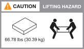

= ASA R2存储系统的安装要求
:allow-uri-read: 
:icons: font
:imagesdir: ../media/

[role="lead"]
查看ASA R2存储系统和存储架所需的设备以及吊装预防措施。

== 安装所需的设备

要安装ASA R2存储系统、您需要以下设备和工具。

* 访问Web浏览器以配置存储系统
* 静电放电(ESD)带
* Flashlight
* 具有USB/串行连接的笔记本电脑或控制台
* 回形针或窄尖头圆珠笔、用于设置NS224存储架ID
* Phillips #2 screwdriver

== 提升注意事项

ASA R2存储系统和NS224存储架很重。搬运这些物品时请务必小心。

=== 存储系统重量

移动或抬起ASA R2存储系统时、请采取必要的预防措施。

[role="tabbed-block"]
====
.ASA A1K
--
ASA A1K存储系统的重量可达22.83磅(28.5千克)。要抬起系统、请由两个人或一个液压提升装置来完成。

image::../media/drw_a1k_weight_caution_ieops-1698.svg[AFF A1K提升注意图标]

--
.ASA A70和ASA A90
--
ASA A70存储系统或ASA A90存储系统的最大重量为151.68磅(68.8千克)。要提升系统、请使用四人或液压提升装置。

image::../media/drw_a70-90_weight_icon_ieops-1730.svg[AFF A90]

--
====

=== 存储架重量

NS224存储架的重量不超过66.78磅(30.29千克)。要抬起存储架、请两个人或使用液压升降机。将所有组件(前部和后部)保留在存储架中、以防止存储架重量不平衡。

.相关信息
* https://library.netapp.com/ecm/ecm_download_file/ECMP12475945["安全信息和法规声明"^]

.下一步是什么？
查看硬件要求后，您可以link:prepare-hardware.html["准备安装ASA R2存储系统"]：
