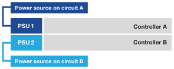

= 启动ASA R2存储系统
:allow-uri-read: 
:icons: font
:imagesdir: ../media/

[role="lead"]
在为ASA R2存储系统安装机架硬件并为控制器和存储架安装缆线后、您应打开存储架和控制器的电源。

== 第1步：打开磁盘架电源并分配磁盘架ID

每个磁盘架都有一个唯一的磁盘架ID来区分。此ID可确保存储架在存储系统设置中是不同的。

.关于此任务
* A valid shelf ID is 01 through 99.
+
如果控制器中集成了内部磁盘架(存储)、则会为其分配一个固定磁盘架ID 00。

* 您必须重新启动磁盘架(拔下两根电源线、等待适当的时间、然后重新插入)、以使磁盘架ID生效。

.步骤
. 首先将电源线连接到磁盘架、使用电源线固定器将其固定到位、然后将电源线连接到不同电路上的电源、以此为磁盘架通电。
+
插入电源后、磁盘架将自动启动。

. 卸下左端盖、以便接触面板后面的磁盘架ID按钮。
+
image::../media/drw_change_ns224_shelf_id_ieops-836.svg[Change shelf ID]

+
[cols="20%,80%"]
|===

 a| 
image::../media/icon_round_1.png[标注编号1]
 a| 
磁盘架端盖

 a| 
image::../media/icon_round_2.png[[插图编号2]
 a| 
磁盘架面板

 a| 
image::../media/icon_round_3.png[[插图编号3]
 a| 
磁盘架ID编号

 a| 
image::../media/icon_round_4.png[[插图编号4]
 a| 
磁盘架ID按钮

|===
. Change the first number of the shelf ID:
+
.. 将回形针或窄尖头圆珠笔的伸直端插入小孔中、以按下磁盘架ID按钮。
.. 按住磁盘架ID按钮、直到数字显示屏上的第一个数字闪烁、然后松开该按钮。
+
It can take up to 15 seconds for the number to blink.This activates the shelf ID programming mode.

+

NOTE: 如果ID闪烁时间超过15秒、请再次按住磁盘架ID按钮、确保一直按到底。

.. 按下并释放磁盘架ID按钮、将该数字前进、直到达到所需数字0到9为止。
+
Each press and release duration can be as short as one second.

+
The first number continues to blink.

. Change the second number of the shelf ID:
+
.. Press and hold the button until the second number on the digital display blinks.
+
It can take up to three seconds for the number to blink.

+
The first number on the digital display stops blinking.

.. 按下并释放磁盘架ID按钮、将该数字前进、直到达到所需数字0到9为止。
+
The second number continues to blink.

. 锁定所需的数字、并按住磁盘架ID按钮退出编程模式、直到第二个数字停止闪烁。
+
It can take up to three seconds for the number to stop blinking.

+
数字显示屏上的两个数字开始闪烁、大约五秒钟后琥珀色LED亮起、提醒您待定磁盘架ID尚未生效。

. 重新启动磁盘架至少10秒钟、以使磁盘架ID生效。
+
.. 从磁盘架上的两个电源拔下电源线。
.. Wait 10 seconds.
.. 将电源线重新插入磁盘架电源以完成重新启动。
+
插入电源线后、电源将立即打开。其双色LED应呈绿色亮起。

. Replace the left end cap.

== 第2步：打开控制器的电源

打开存储架并为其分配唯一ID后、打开存储控制器的电源。

.步骤
. 将笔记本电脑连接到串行控制台端口。这样、您就可以在控制器通电时监控启动顺序。
+
.. 使用N-8-1将笔记本电脑上的串行控制台端口设置为115、200波特。
+
有关如何配置串行控制台端口的说明，请参阅便携式计算机的联机帮助。

.. 将控制台缆线连接到笔记本电脑、然后使用存储系统随附的控制台缆线连接控制器上的串行控制台端口。
.. 将笔记本电脑连接到管理子网上的交换机。
+
[role="tabbed-block"]
====
.A1K
--
image::../media/drw_a1k_70-90_console_connection_ieops-1702.svg[控制台连接]

--
.A70和A90
--
image::../media/drw_a1k_70-90_console_connection_ieops-1702.svg[控制台连接]

--
.-20、A30和A50
--

--
====

. 使用管理子网上的TCP/IP地址为笔记本电脑分配TCP/IP地址。
. Plug the power cords into the controller power supplies, and then connect them to power sources on different circuits.
+
[role="tabbed-block"]
====
.A1K
--
image::../media/drw_affa1k_power_source_icon_ieops-1700.svg[A1K存储系统和A70或A90电源连接图]

--
.A70和A90
--
image::../media/drw_affa1k_power_source_icon_ieops-1700.svg[A1K存储系统和A70或A90电源连接图]

--
.-20、A30和A50
--

--
====
+
** 系统将启动启动过程。初始启动顺序可能需要长达八分钟的时间。
** 在启动过程中、您将看到LED闪烁、风扇激活、并发出控制器正在启动的信号。
** 请注意、风扇在首次启动时可能会发出较高的噪音。启动期间风扇噪音正常。
** 对于ASA A20、ASA A30和ASA A50存储系统、系统机箱正面的磁盘架ID显示屏不会亮起。

. 使用每个电源上的固定设备固定电源线。

.下一步是什么？
打开ASA R2存储系统后，您将link:initialize-ontap-cluster.html["设置ONTAP ASA R2集群"]。
